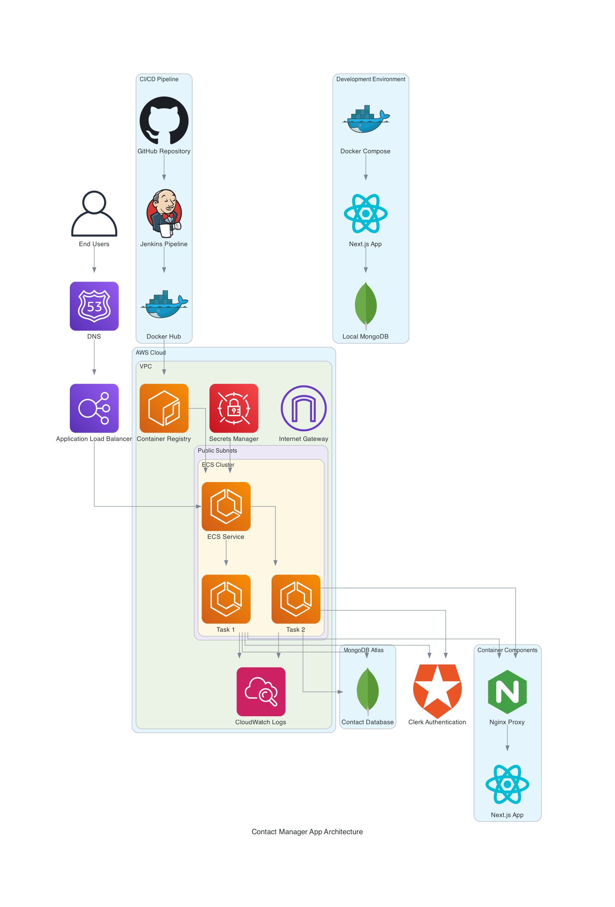

# 📇 Contact Manager App

A modern contact manager built with **Next.js**, **Clerk Authentication**, and **MongoDB**. Logged-in users can securely manage their own contacts with options to add, edit, delete, call, WhatsApp, or email them.

## ✨ Features

- 🔐 User authentication with **Clerk**
- 📥 Add new contacts (Name, Phone, Email)
- 📄 View all contacts (only for logged-in user)
- 🔍 Search contacts by name/email/phone
- ✏️ Edit contact details
- 🗑️ Delete contacts (with confirmation)
- 📞 One-click Call, WhatsApp, and Email
- 💾 Data stored securely in **MongoDB**

---

## 🛠️ Tech Stack

| Technology | Description |
|------------|-------------|
| Next.js    | React framework for frontend & API routes |
| Clerk      | Authentication (SignUp / SignIn / User ID) |
| MongoDB    | NoSQL database to store contact data       |
| TailwindCSS| Utility-first styling                      |
| Docker     | Containerization for consistent deployment |

---

## 🔧 Setup Instructions

### 1. Clone the Repo

```bash
git clone https://github.com/debabrat013/contact_appp.git
cd contact_appp
```

### 2. Install Dependencies

```bash
npm install
```

### 3. Configure Environment Variables

Create a `.env.local` file in the root and add:

```env
CLERK_PUBLISHABLE_KEY=your_clerk_publishable_key
CLERK_SECRET_KEY=your_clerk_secret_key

MONGODB_URI=your_mongodb_connection_string
```

### 4. Run the App

```bash
npm run dev
```

App will be live at: `http://localhost:3000`

---

## 🏗️ Architecture Diagram



The architecture diagram shows the complete system design including:
- User access layer with load balancing
- AWS Cloud infrastructure (VPC, ECS, ECR)
- CI/CD pipeline with Jenkins
- Development and production environments
- External services integration (MongoDB Atlas, Clerk Authentication)
- Monitoring and logging components

---

## 🐳 DevOps Implementation

This project implements several DevOps best practices for reliable, scalable deployment:

### Containerization
- **Docker Container**: Application packaged in a lightweight container
- **Environment Consistency**: Same behavior across development, testing, and production
- **Isolation**: Application and dependencies run in isolated environment
- **Dockerfile**: Multi-stage build process for optimized images

### Infrastructure as Code (IaC)
- **Docker Configuration**: Infrastructure defined as code in Dockerfile
- **docker-compose.yml**: Service orchestration defined in code
- **Terraform**: AWS infrastructure provisioned and managed as code
- **Parameterized Configuration**: Environment variables for flexible deployment

### CI/CD Pipeline
- **Jenkins Pipeline**: Complete CI/CD workflow from code to deployment
- **Automated Testing**: Unit and integration tests run automatically
- **Automated Builds**: Streamlined image building process
- **Container Registry**: Images stored in Docker Hub for easy distribution
- **Multi-environment Deployment**: Separate dev and prod environments
- **Manual Approval**: Production deployments require approval

### Infrastructure Automation
- **AWS ECS**: Container orchestration on AWS
- **Load Balancing**: Automatic traffic distribution with AWS ALB
- **Auto Scaling**: Dynamically adjust capacity based on demand
- **VPC Configuration**: Secure network setup with public/private subnets

### Configuration Management
- **Environment Variables**: Externalized configuration for different environments
- **Secrets Management**: Sensitive data handled via AWS Secrets Manager
- **Runtime Configuration**: Dynamic configuration at container startup
- **Environment-specific Compose Files**: Separate configurations for dev/prod

### Monitoring & Health Checks
- **Health API Endpoint**: Application exposes health status
- **Container Health Checks**: Automatic monitoring of container health
- **CloudWatch Integration**: Logs and metrics collection
- **Nginx Configuration**: Advanced proxy with SSL termination

### Deployment Benefits
- **Portability**: Runs consistently on any platform supporting Docker
- **Scalability**: Ready for container orchestration with ECS or Kubernetes
- **High Availability**: Multiple instances across availability zones
- **Zero-downtime Deployments**: Rolling updates for continuous availability
- **Version Control**: Infrastructure versioned alongside application code

### Docker Hub Repository
- Public image available at: `debabratap/contact-manager-app:latest`
- Pull and run with proper environment variables

---

## 🐳 Docker Usage


## Run with Docker

```bash
docker run -p 3000:3000 \
  -e MONGODB_URI=your_mongodb_connection_string \
  -e CLERK_PUBLISHABLE_KEY=your_clerk_publishable_key \
  -e CLERK_SECRET_KEY=your_clerk_secret_key \
  debabratap/contact-manager-app:latest
```

### Run with Docker Compose

Create a `docker-compose.yml` file:

```yaml
version: '3'
services:
  contact-app:
    image: debabratap/contact-manager-app:latest
    ports:
      - "3000:3000"
    environment:
      - MONGODB_URI=your_mongodb_connection_string
      - CLERK_PUBLISHABLE_KEY=your_clerk_publishable_key
      - CLERK_SECRET_KEY=your_clerk_secret_key
```

Then run:

```bash
docker-compose up
```

---

## 🧠 Project Structure

```
app/
├── api/
│   └── contacts/         # API route handlers (POST, GET, PUT, DELETE)
├── page.tsx              # Home page after login
components/
├── ContactCard.tsx       # Contact UI with Call, WhatsApp, Email
├── AddContactForm.tsx    # Form to add new contact
utils/
├── db.ts                 # MongoDB connection utility
models/
├── Contact.ts            # Mongoose schema for contact
```

---

## 🔒 Authentication Flow

* Uses **Clerk** for user login/signup.
* Each contact is tied to the `userId` provided by Clerk.
* API endpoints are protected to handle only that user's data.

---

## 📱 UI Preview

(Include a screenshot or short gif here)

---

## 🚀 Deployment Options

### Vercel Deployment
Can be deployed on **Vercel** with:
* MongoDB Atlas for database
* Clerk credentials set in Vercel environment variables

### Container Deployment
* Deploy the Docker container to any cloud provider:
  * AWS ECS/EKS
  * Google Cloud Run/GKE
  * Azure Container Instances/AKS
* Set environment variables in your cloud provider's configuration

---

## 🤝 Contributing

Pull requests are welcome. For major changes, please open an issue first.

---

